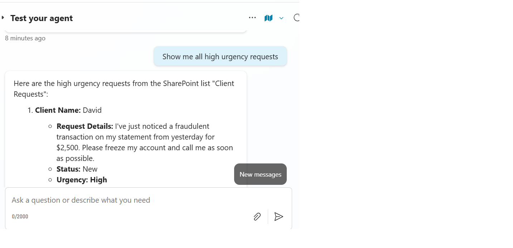

# Copilot-Client-Intake-POC
# Microsoft Copilot – AI-Powered Client Intake Automation (POC)

A Proof-of-Concept (POC) demonstrating how to integrate **Microsoft Power Platform** (Forms, Power Automate, SharePoint, Outlook) with **Copilot Studio** to build an AI-driven client intake and triage system.  

This project showcases **low-code AI orchestration** and **agentic workflow automation** in the Microsoft ecosystem.

---

## 🚀 Overview
Financial advisory and service teams often receive dozens of client queries daily, ranging from routine questions to urgent requests.  
Manually sorting, prioritizing, and responding to these requests is time-consuming and error-prone.  

This POC automates the process:
1. **Client submits a form** (via Microsoft Forms).  
2. **Power Automate flow triggers** → captures form data.  
3. **Rule-based urgency classification** (keywords like *urgent*, *emergency*) is applied.  
4. **SharePoint list** stores all client requests with urgency status.  
5. **Automated email notifications** are sent to confirm intake.  
6. **Copilot Studio chatbot** enables natural language queries over the stored requests.
## 📸 Screenshots

### 1. Microsoft Form – Client Intake


### 2. Power Automate Flow – Trigger → Condition → Create item


### 3. SharePoint List – Client Requests with Urgency column
[📄 View SharePoint Screenshot (PDF)](assets/ClientRequestsSite.pdf)


### 4. Copilot Studio – Chatbot responding to queries




---

## 🛠️ Tools & Technologies
- **Microsoft Forms** – client intake form.  
- **Power Automate** – workflow automation.  
- **SharePoint List** – structured data storage.  
- **Outlook** – automated email replies.  
- **Copilot Studio** – conversational agent for natural language queries.  
 

---

## ⚙️ Workflow Architecture
```text
Client Form (Forms)
        ⬇
Power Automate Flow
        ⬇
Urgency Classification (rule-based)
        ⬇
SharePoint List (Client Requests)
        ⬇
Email Confirmation (Outlook)
        ⬇
Copilot Studio (Query Interface)
